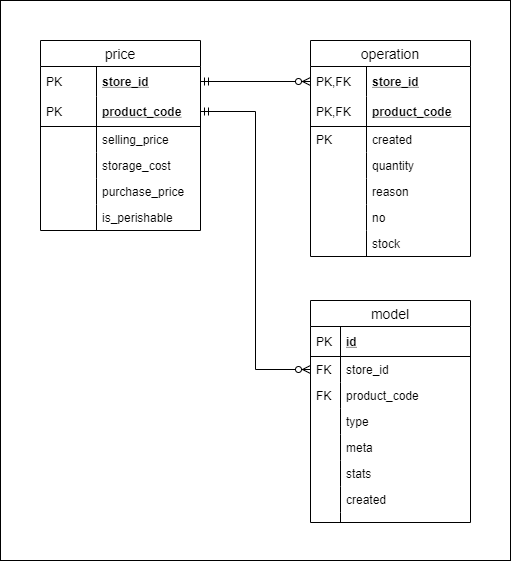

# logistics-index-db

Liquibase formatted SQL code for [logistics-index](https://github.com/eipanteleev-lm/logistics-index) project

## Summary

Liquibase formatted SQLite code for stock operations data storage and preview

## Repository structure

```
.
|-data
|  |-changelog.xml
|  |-prices.sql
|-tables
|  |-model.sql
|  |-operation.sql
|  |-price.sql
|-views
|  |-changelog.xml
|  |-operations_daily.sql
|  |-operations_monthly.sql
|  |-operations_weekly.sql
|  |-stock_optimum_monthly.sql
|  |-stock_optimum_weekly.sql
|-.env
|-.gitignore
|-changelog.xml
|-docker-compose.yml
|-init.sql
|-logistics-index-db.png
|-README.md
```

## Database schema



## Testing

```sh
docker-compose config
docker-compose up
```
